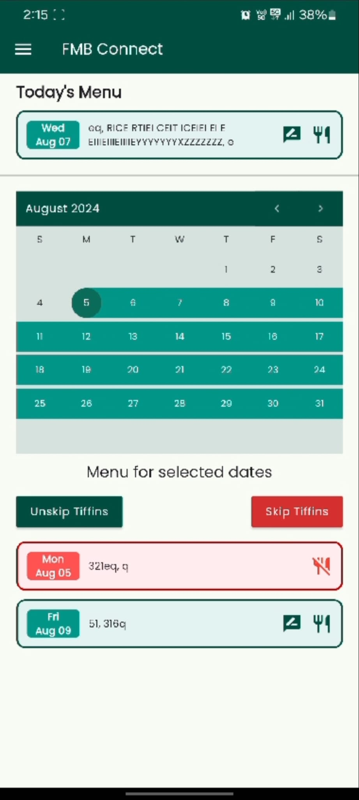
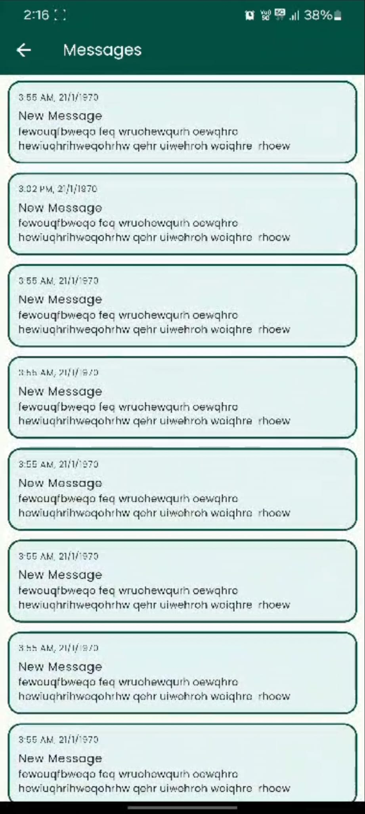
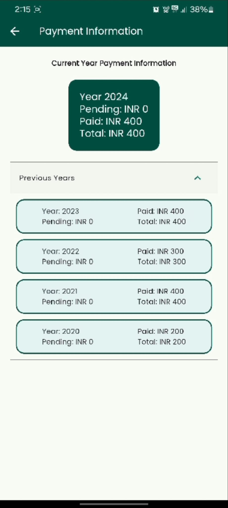
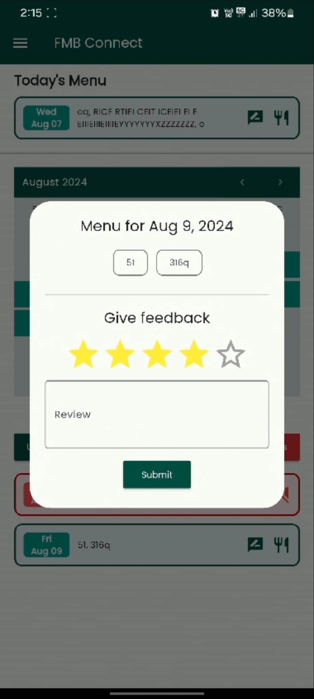

# FMB Connect

Tiffin Management For FMB Users

## What it does

FMB Connect is a mobile app that helps users manage their tiffin service. Users can:

- Select date ranges and choose to skip receiving tiffins for those dates
- View the menu for each date and give feedback on the tiffin
- View their payment history and track current/past year payments
- Receive and view notification messages

## Features

- **Menu Management**: View today's menu and upcoming menus
- **Date Selection**: Skip or unskip tiffins for specific dates using the calendar
- **Feedback System**: Rate and review tiffins for each date
- **Payment Tracking**: View payment history by year with pending and paid amounts
- **Notifications**: Receive and read important messages

## Built with

- **Flutter** - Cross-platform mobile app development
- **Firebase Cloud Messaging (FCM)** - Push notifications

### Main Menu & Calendar

### Messages

### Payment Information

### Feedback Dialog
